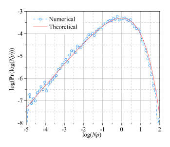

# Simulating Random Quantum Circuit with PEPS

This repo presents the Python code used for the simulations in our [paper](1905.08394.pdf).

## Introduction

Simulating Random Circuit Sampling using Projected Entangled Pair States (PEPS):

* The performance of matrix product states is much less effective if the underlying quantum system is essentially two-dimensional.
* The Projected Entangled-Pair States (PEPS) is a tensor-network quantum states representation designed for two-dimensional lattices.

Our PEPS-based simulator is a general-purpose quantum circuit simulator for arbitrary quantum circuits:

* Stores the full quantum state
* Can be used to compute single amplitudes, observables, and also perform sequences of quantum measurements.

## Implementation

To demonstrate the performance of our method, we have developed Python code to perform small scale simulations on a personal computer. It takes less than 1 hour to compute one amplitude of a 8 × 8 circuit to a depth (1 + 25 + 1) for a machine with 2 cores of 2.8 GHz frequency and 16 GB memory. We computed 10,000 amplitudes, then plotted the frequency with which each probability of configurations appear. The red continuous line shows the Porter-Thomas distribution, which is what is expected theoretically.



## Usage

```
python3 -m venv ./venv
source ./venv/bin/activate
pip3 install numpy scipy
python3 ./randomquantumcircuit.py
```

